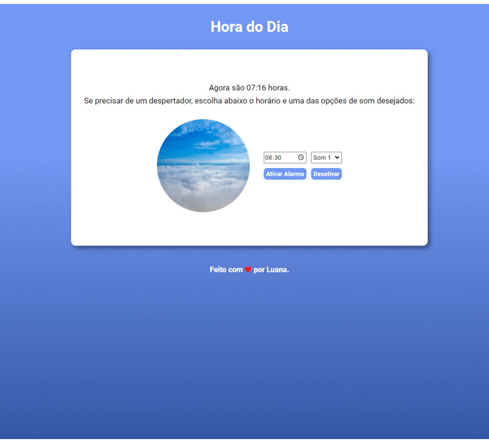

# What time is it?

> Uma página web que mostra a hora atual (e atualiza conforme o tempo passa) e, conforme o horário, altera a cor de fundo e a imagem.

<b>A web page pode ser visualizada [aqui](https://whatimeisit.netlify.app/).</b>

## 🤝 Colaboradores

<table>
  <tr align="center">
    <td>
      <a href="#">
         
        
          <b>Luana</b>
        
      </a>
    </td>   
  </tr>
</table>

